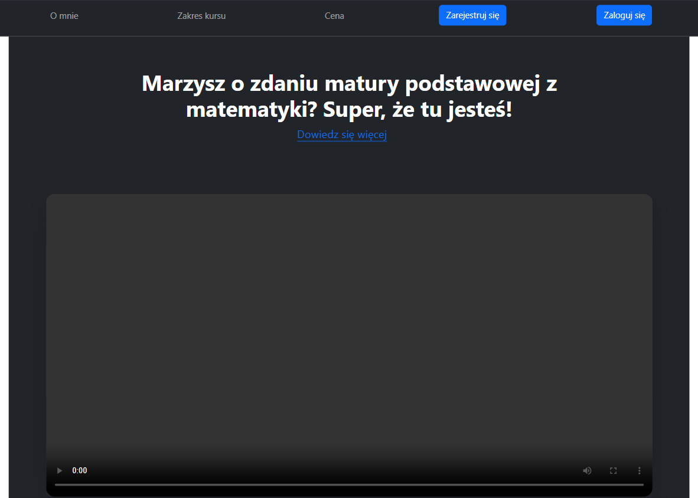
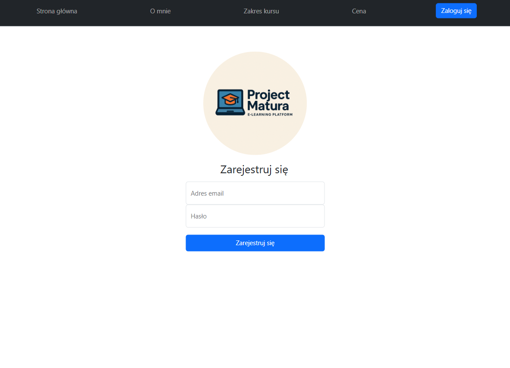
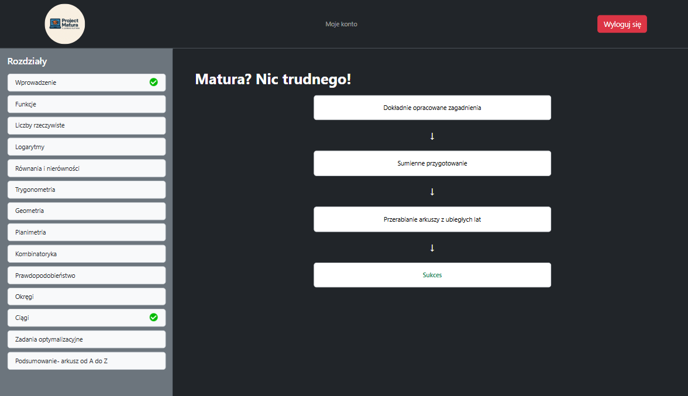
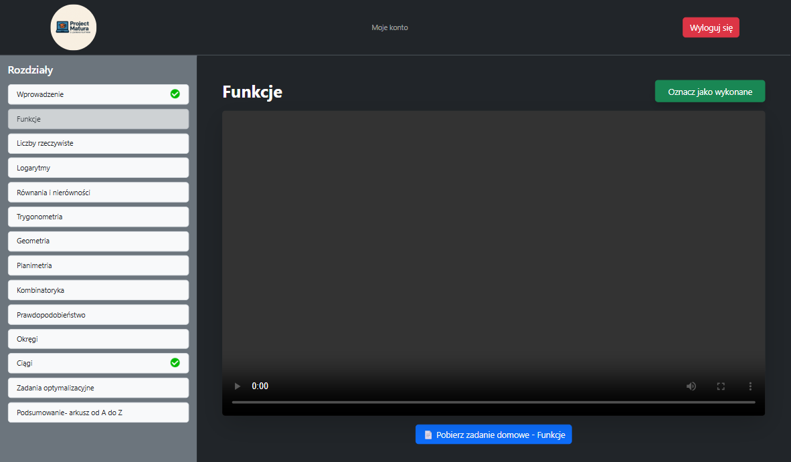
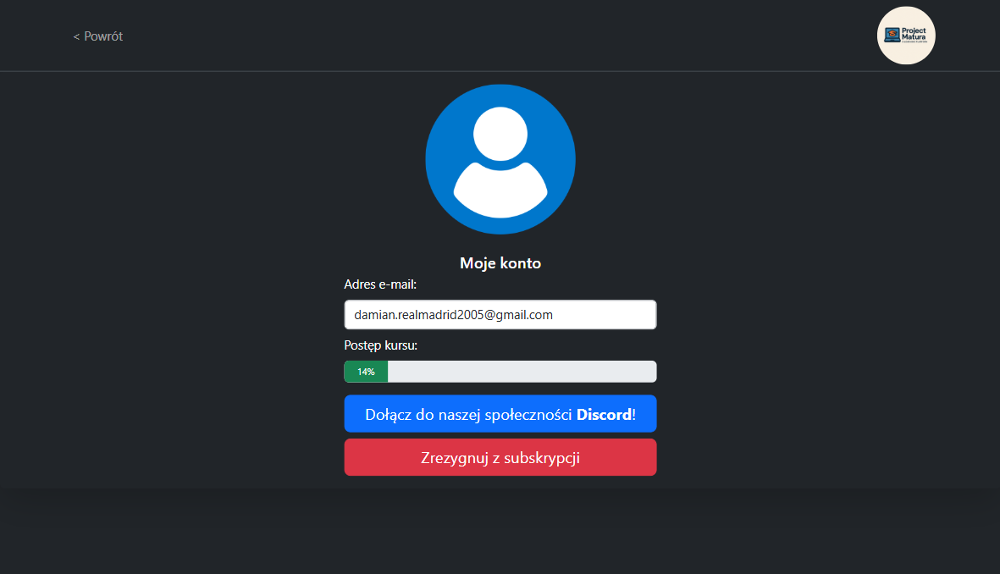

### ProjectMatura.io
ProjectMatura.io is an e-learning platform with the aim to help Polish students pass their math matura exam.
The aim is to make quality educational content that are supported with top notch technologies. The goal is to
provide continous service. 

### Snapshots






## Features
- Subscription based monthly payments
- Persistant remember me cookies
- Responsiveness
- User authorization
- Confirmation emails

## Technologies in use
- PostgresQL
- Django
- Bootstrap
- Javascript, HTML(Jinja2 templating language)
- Docker
- Stripe

## Useful commands:
```console
Set-ExecutionPolicy -ExecutionPolicy RemoteSigned -Scope Process
.\venv\Scripts\Activate.ps1
django-admin startproject myapp
python manage.py runserver
pip freeze > requirements.txt
stripe listen --forward-to localhost:8000/webhook/

docker build -t project_matura_io .
docker compose up --build
docker compose down
```
